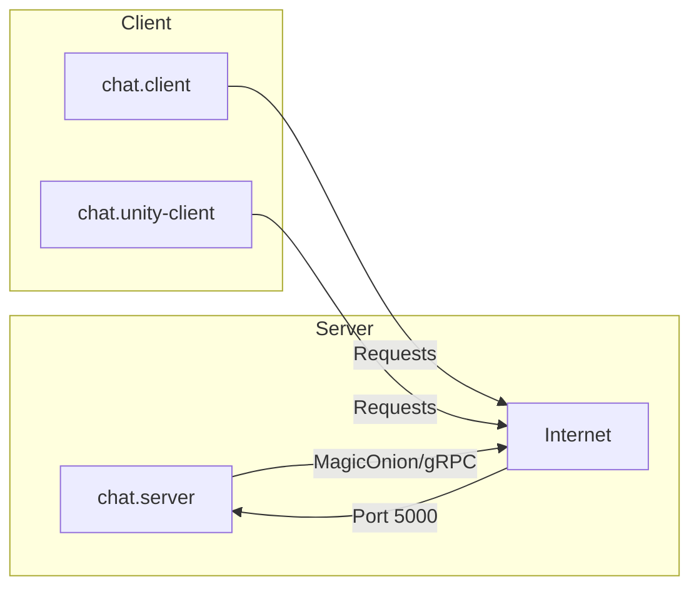

# Chat App
Simple Chat using MagicOnion

## Requirements
* C# 8+
* Unity 2021+
* Docker 21+

## Modules

* [Client](./Chat.Client/) - Console client
* [Client-Unity](./Chat.Client-Unity/) - Game client
* [Server](./Chat.Server/) - Server and chat logic
* [Shared](./Chat.Shared/) - Message definition

